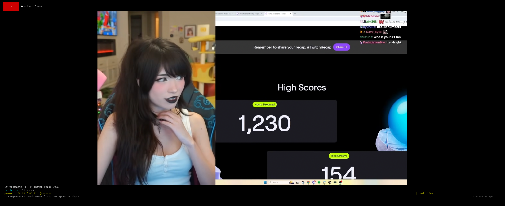

# yeetee
## A TUI YouTube client

This is a basic YouTube client with OAuth2 device flow login support. My goal was to make watching YT in a terminal as smooth as possible. I strongly dislike browsers, but I also watch YouTube, and existing solutions didn't work well for me. The creds configured are well-known "smart TV" creds that anyone can use.
The project depends on my util lib, available at: [libdangling](https://github.com/danglingptr0x0/libdangling)

Feed:

Search results:

Video playback:

